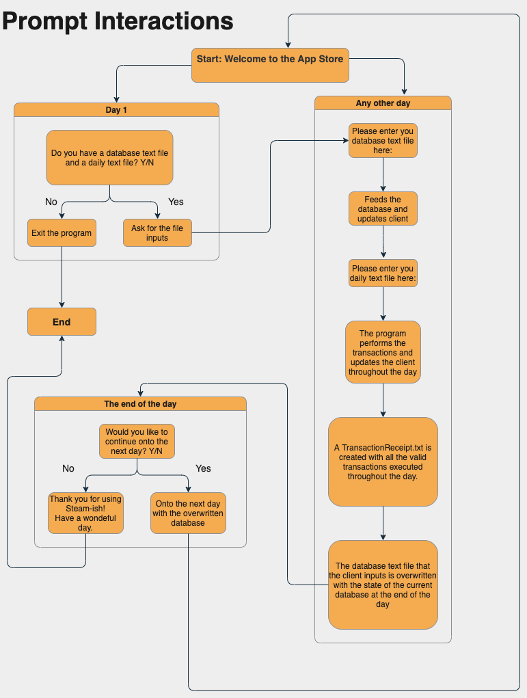

_________________
# Welcome to the *AppStore-CLI* 

## This program showcases the basic structure of an App Store.
_________________

## <u> What you need to use the system  </u>
#### Before you run this program, you must have two files at hand: Please refer to fileformats.md for more information.
_________________
## <u> How to use the system  </u>

> 1. Before you run this program, *you must have the two text files inside the project folder* (mentioned in the previous section)
> 2. To run this program, you need to run Controller.java, located in the src/main folder
>> It will prompt you to do step 3 &  step 4
> 3. The system will ask you if you have the two required files (one database text file and one daily text file) with you at hand. Then, you enter your answer (Yes or No), in which case the program branches off:
>> * If you enter "Yes", then proceed to step 4
>> * If you enter "No", the system will remind you to get the files for the next time you run the program and will terminate. Please get the required two text files and run the program again (go to step 1).
> 4. Please write the file name of the database.txt file that you will be providing as such :
>> *databaseFileName.txt*
>
> - If the file is valid and the inputted database text file has been read successfully, a message will appear saying that your database text file has been processed, which implies the system's database is populated and you're good to go!
> - If the controller is unable to find this file it will ask you to provide the name of a database file that it can access.
> 4. Please write the file name of the daily.txt file that you will be providing as such :
>> *dailyFileName.txt*
>
> - If the controller is unable to find this file it will ask you to provide the name of a daily file that it can access.
> 5. After feeding the Controller.java those two files, the terminal will output Strings entailing what was fed onto the database and all the transactions that occurred that day, along with any error messages if there were any
> 6. Once the day is over, you will notice the production of a new file called *transactionReceipt.txt*. This is a new file that stores the codes of all
     the **successful** transactions that occurred in that day.
> - **NOTE:** the *transactionsReceipt.txt* file follows the **SAME** format as the daily text file
> 7. The database file provided is then overwritten with the current state of the database:
>> i.e. if a user puts money in their account, then the database will have an updated account balance
> - **NOTE:** if you want to run the program with the same database text file, you **must** change the database text file to its original self before you ran it (i.e, copy and paste your database text file from before you ran the program.)
>- If you do not make this change, then if you run the program again, it will not give you the desired output.
   > This is why an *originalDatabaseCopy.txt* file is provided for you
> 8. The program will tell you that the day is over, as all the files have been processed. Now, it will prompt you with what you want to do next (i.e. the program branches off again). It will ask if you would you like to continue to the next day or finish?
>> * If you enter "Yes", the program will run again and proceed to the next day, asking for a database text file and daily text file
>> * If you enter "No", the program will thank you for using it and terminate. If you select "No" but you wanted to continue, simply run the program again and follow steps 1-9!
> 9. Congratulations! You just ran our program! We encourage you to play around with different database text files and daily transaction text files
> 
